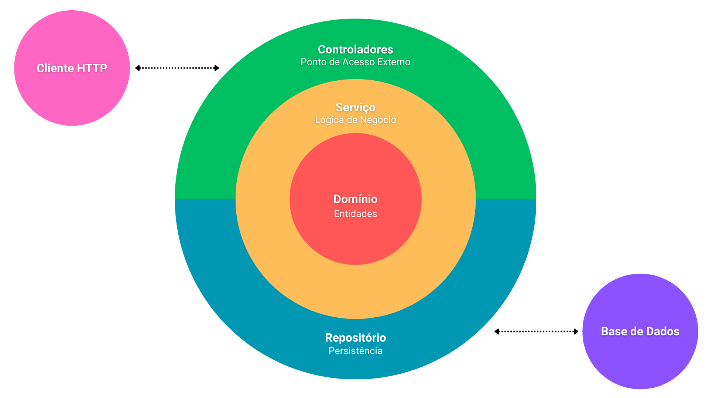
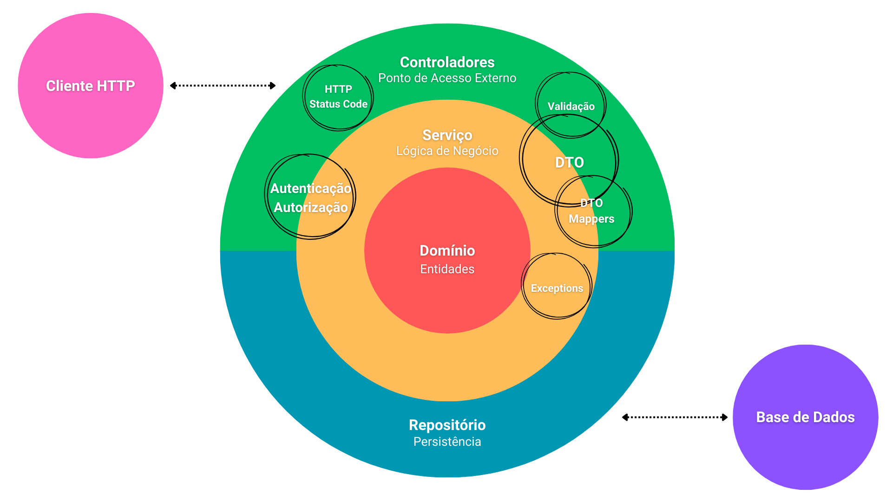
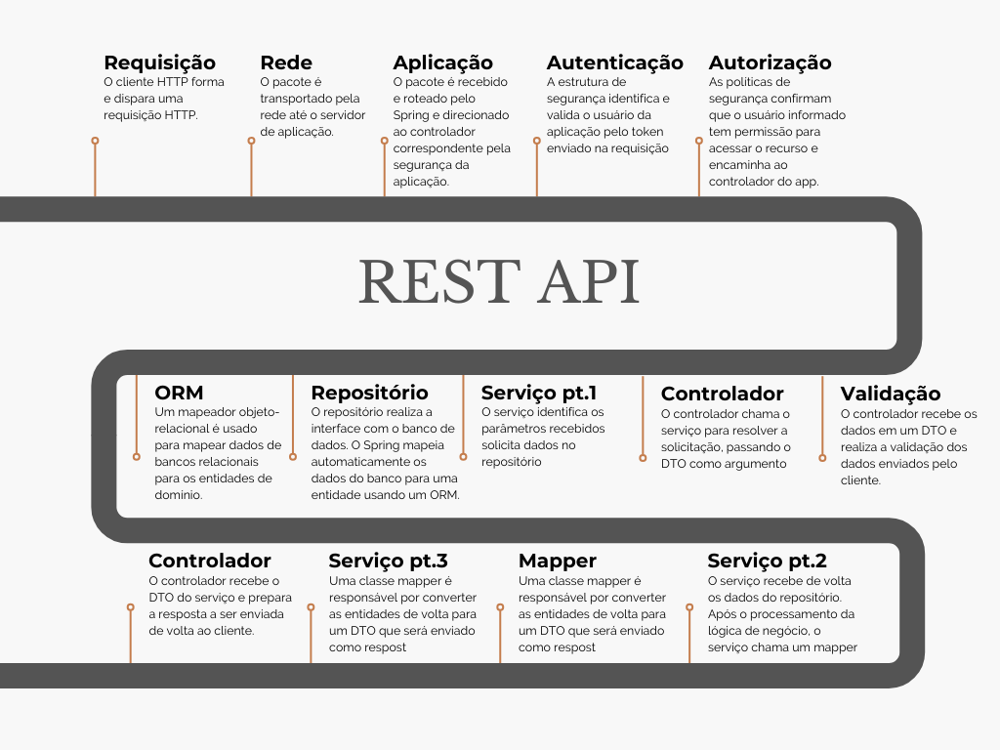
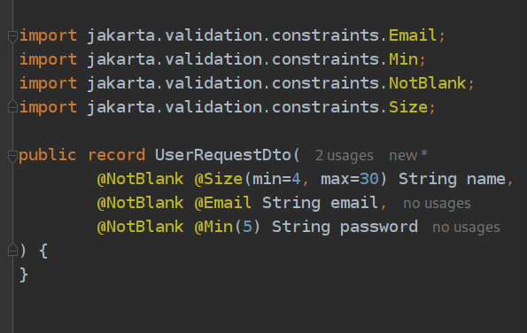
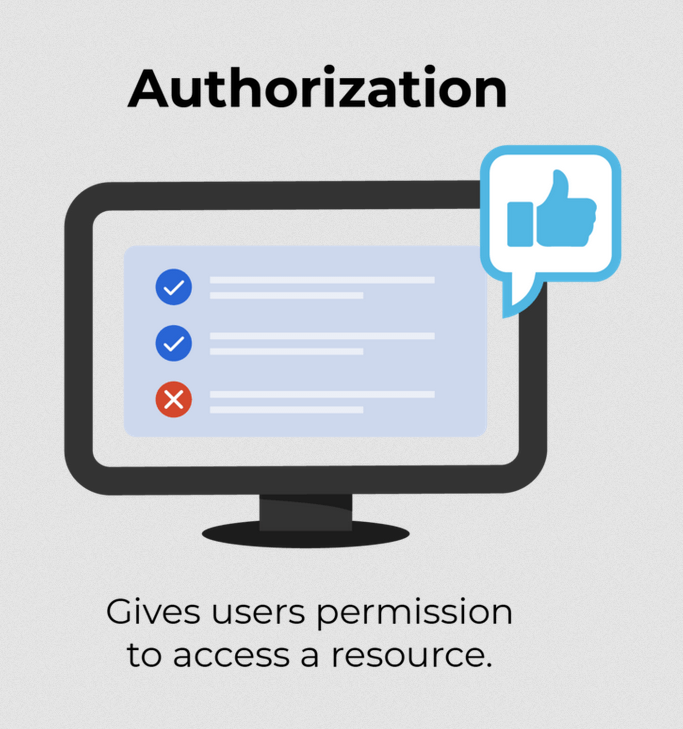

<!-- 
_class: lead
-->

# Aula 12 - Enterprise Service

---

<!--
paginate: true
class: normal
-->

## Enterprise Applications

> "Os aplicativos corporativos tratam da exibição, manipulação e armazenamento de grandes quantidades de dados muitas vezes complexos e do suporte ou automação de processos de negócios com esses dados." - Martin Fowler

- Multi-usuário e concorrência
- Alto padrão (Patterns e Arquitetura)
- Persistência, Validação, Integridade, Transações, Camadas...

---

---

# RESTful Services

- Interface padronizada para troca de dados
- Baseado em **Recursos**
- Sistema de Camadas
- REST Design é aplicado nos controladores

---

> Arquitetura em
> camadas

---

> Alguns recursos são
> implementados em
> intercamadas

---

> Ciclo
> de Vida

---

## Desenvolvimento

### External Layer

    - Validações
    - HTTP Codes
    - Controller REST

---

### Validações

Validações para entidades e records garantindo integridade dos dados.

> Bean Validation fornece uma forma comum de validação por meio de declaração de restrição e metadados para aplicativos Java

---

### HTTP Codes

Definição correta dos códigos de estado do HTTP

> O código status 206 indica que a solicitação foi bem-sucedida e o corpo contém os intervalos de dados solicitados.

---

### Controler REST

Definição de uma interface de comunicação padronizada e centrada em Recursos

> REST rapidamente se tornou o padrão a construção de serviços web na web porque eles são fáceis de construir e consumir

---

### Serviços
    - Data Transfer Objects
    - Mappers

### Domínio
    - Models/Entities

### Persitência
    - Repositories

---

### Data Transfer Objects

Definir corretamente objetos para a transferência de dados entre cliente e servidor.

> "DTOs mantêm lógica fora do resto do código e também fornecem um ponto claro para alterar a serialização, caso deseje" - Martin Fowler

---

### Mappers

Mapeamento de objetos para objetos

> "Às vezes você precisa configurar comunicações entre dois subsistemas que ainda precisam permanecer ignorantes um do outro." - Martin Fowler

---

### Models

Modelagem dos objetos que serão centro da aplicação, contendo todos os dados necessários para o funcionamento

---

### Repositories

Interface da aplicação com persistência de dados

> O Repositorio fornece funcionalidade CRUD sofisticada para a classe de entidade que está sendo gerenciada.

---

### Segurança
    - Autenticação
    - Autorização
  
### Infraestrutura
    - Docker
    - Database (PostgreSQL)
    - Implantação (Deploy)
    - Testes Unitários *
    - Documentação *

---

### Autenticação

Processo de reconhecimento de um cliente/usuário identificado.

---

### Autorização

Processo de autorização de acesso à um usuário/cliente já autenticado

---

### Docker

Encapsulamento de bibliotecas e ambientes em **containers padronizados**

> Com o Docker, os aplicativos e seus ambientes são virtualizados e isolados uns dos outros em um sistema operacional compartilhado do computador host.
---

### Database

Gerenciadores de dados persistentes.

> Um banco de dados é uma coleção organizada de informações estruturadas, ou dados, armazenados em um computador.

---

### Deploy

Disponibilização a um público (ambiente de produção). Requer a configuração de infraestruturas específicas.

---

### Testes Unitários

Teste de funções usando JUnit.

> Uma das principais vantagens da injeção de dependência é que ela deve facilitar o teste de unidade do seu código. Você pode usar objetos simulados em vez de dependências reais.

---

---

### Documentação

A padronização da API ajuda na sua auto-documentação. Porém podemos utilizar de ferramentas para aprimorar a documentação dos detalhes da API