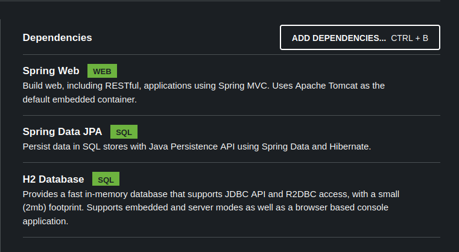

<!-- 
_class: lead
-->

# Aula 16 - Repositórios

---

<!--
paginate: true
class: normal
-->

## Persistência de Dados


* Dado preservados após o tempo de vida da aplicação;
* Oposto de **Dados Efêmeros**;
* Dados armazenados diferentes estruturas de hardware/software;

> Não confundir com Estruturas de Dados Persistentes (*Persistent Data Structure*);

---

### Exemplos de dados persistentes

* Clipe de música salvo no sistema de arquivos;
    * O sistema de arquivos pode estar contido em um HDD ou Pendrive.
* Registro de compra, salvo em um banco de dados Postgres
    * O banco de dados é uma abstração para os dados que serão armazenados em uma mídia persistente (como um HDD);
* Logs de erros da aplicação armazenados em um arquivo de texto;

---

#### Não são exemplos de dados persistentes

* Objetos da aplicação mantidos na memória;
* Mensagens HTTP ou de qualquer outro protocolo de rede;
* Qualquer tipo de dado armazenado em memória não persistente (DRAM, Cache, Registradores).

---

## Camada de Persistência


Vamos definir uma nova camada de persistência para abstrair todas as interações relacionadas à persistência dos dados.

Para isso vamos usar um padrão (*pattern*) chamado **Repositórios**.

---

## Repositórios


* Isolamento da persistência dos dados;
* Mediação entre domínio (models) e mapeamento (relacional);
* Define operações da aplicação sobre a persistência.

<small>[Repository Pattern por Martin Fowler](https://martinfowler.com/eaaCatalog/repository.html)</small>

---

## Repositórios no Spring


* Utiliza o Spring Data JPA como base;
* Define uma mesma interface para todos os tipos de persistência;
* Recebe um driver e, em conjunto com o spring boot, configura automaticamente.
 
---

### Dependências



* Spring Web
* Spring Data JPA
* Conexão com Banco (H2, Postgres, Maria, Oracle...)

---

### Classes de Repositório

Das classes abaixo, pela hierarquia de funcionalidades e herança:

* `Repository`
* `CrudRepository`
* `PagingAndSortingRepository`
* `JPARepository`

> `Repository` possui a menor quantidade de métodos, enquanto `JPARepository` extende as funcionalidades de todas as outras classes.

---

### Model

No modelo, vamos adicionar as anotações `@Entity` e `@Table` (com o nome da tabela a ser gerada), além de um `@Id` `@GeneratedValue`, que define a chave primária e automatiza a geração do ID.

````java
@Entity
@Table(name = "artistas")
public class Artista {
    @Id
    @GeneratedValue(strategy = GenerationType.UUID)
    private UUID id;
    private String nome;
    private String genero;
    private Integer seguidores;
    private Boolean ativo;
}
````

---

### JPARepository

Criando uma classe de repositório para a entidade `Artista`. Usamos o `<Modelo, TipoPrimaryKey>`:

````java
@Repository
public interface ArtistaRepository extends JpaRepository<Artista, UUID> {
}
````

---

### Service

#### Injetando repositório no service

Vamos injetar uma instância de repositório para habilitar a manipulação no *service*:

````java
@Service
public class ArtistaService {
    @Autowired
    ArtistaRepository artistaRepository;
}
````

---

#### Retornando todas as instâncias

Podemos utilizar o método `findAll()` para retornar todas as instâncias do modelo:

````java
public List<Artista> getAll() {
    return artistaRepository.findAll();
}
````

---

#### Retornando instância pelo ID

Podemos utilizar o método `findById()` para retornar uma instância específica do modelo:

````java
public Artista getOne(UUID id) {
    return artistaRepository.findById(id);
}
````

---

#### Salvando nova instância

Para salvar uma nova instancia, precisamos de um objeto da instância em conjunto com o método `save(entidade)`:

````java
public Artista save(Artista novoArtista) {
    return artistaRepository.save(novoArtista);
}
````

> Também podemos instanciar um novo objeto do tipo `Artista` se for necessário e salvá-lo usando o método `save`.

---

#### Atualizando uma instância pelo ID

Para atualizar uma instancia, precisamos recuperar objeto da instância através do ID. Antes de salvar, é necessário alterar as propriedades pretendidas e então usar o método `save`:

````java
public Artista update(UUID id, Artista artistaUpdate) {
    Artista artista = weaponRepository.findById(id).get();
    artista.setNome(artistaUpdate.getNome());
    artistaRepository.save(artista);
    return artista;
}
````

---

#### Deletando uma instância pelo ID

Para deletar uma instancia, precisamos recuperar objeto da instância através do ID e então deletá-lo usando o método `delete(entidade)`:

````java
public List<Artista> delete(UUID id) {
    Artista artista = weaponRepository.findById(id).get();
    artistaRepository.delete(artista);
    return artista;
}
````

> Também é possível usar o método `deleteById` caso não haja a necessidade de retornar o objeto deletado

---

### Métodos Comuns

|Método|Descrição|
|-|-|
|`findAll()`| Retorna todas as instâncias |
|``findAll(pageable)``| Retorna todas as instâncias com configuração de paginação|
|`getById(id)`| Retorna uma instância de acordo com o ID |
|`getReferenceById(id)`| Retorna uma referência da instância pelo ID|
|`save(entidade)`| Salva a entidade passada como argumento|
|`delete(entidade)`| Deleta a entidade passada como parâmetro|

---

## Queries Derivadas

O Spring Data implementa uma linguagem padrão para criação de queries personalizadas baseadas em uma linguagem padrão de métodos.

Para criar um novo método que pesquisa por nome ao invés de ID, podemos incluir o seguinte método no repositório:

````java
@Repository
public interface ArtistaRepository extends JpaRepository<Artista, UUID> {
    List<Artista> findByNome(String nome)
}
````

---

### Outras Queries Derivadas

````java
@Repository
public interface ArtistaRepository extends JpaRepository<Artista, UUID> {
    List<Artista> findByNome(String nome) // retorna todos com o nome
    List<Artista> findTop3BySeguidores() // retorna 3 com mais seguidores
    List<Artista> findByNameIsNot(String name); // retorna todos que nao possuem o nome
    List<Artista> findByAtivoTrue(); // retorna todos com atributo ativo verdadeiro
    List<Artista> findByNomeContainingWith(String prefixo); // retorna os que contém o nome
    List<Artista> findBySeguidoresLessThan(Integer numero); // retorna com condicional
    List<Artista> findByNomeOrderBySeguidores(String name); // ordena por seguidores
}
````

Documentação completa [aqui](https://docs.spring.io/spring-data/jpa/reference/jpa/query-methods.html)

---

### Query Customizada

Para os casos onde não é possível realizar consultas ou a otimização do SQL é fundamental, também podemos mapear consultas SQL personalizadas

````java
@Repository
public interface ArtistaRepository extends JpaRepository<Artista, UUID> {
    @Query("SELECT * FROM artistas a WHERE a.seguidores = 0")
    Collection<Artista> findUnknownArtists();
}
````

---

## Configuração do H2

````properties
spring.datasource.url=jdbc:h2:file:./nome-arquivo.db
spring.jpa.generate-ddl=true
spring.jpa.hibernate.ddl-auto=update
spring.h2.console.enabled=true
spring.jpa.show-sql=true
````

* `datasource.url`: define o caminho para o arquivo da base de dados
* `jpa.generate-ddl`: Ativa a geração automática de tabelas
* `jpa.hibernate.ddl-auto`: Gera as tabelas automaticamente (DDL)
* `h2.console.enabled`: Habilita a UI em `http://{hostname:port}/h2-console`
* `jpa.show-sql`: Faz o log das consultas SQL no console

---

## O que aprendemos hoje

* O que é persistência de dados e como separar essa responsabilidade na aplicação;
* Padrão de projeto repositório;
* Como criar um repositório usando Spring Data e seus métodos para manipular o repositório;
* Configurações de banco de dados;