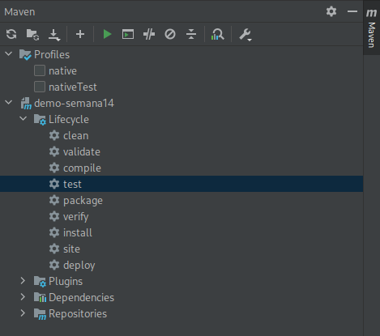

<!-- 
_class: lead
-->

# Aula 18 - Introdução a Testes Unitários

---

<!--
paginate: true
class: normal
-->

## Testes Unitários


* Testa menor parte funcional do código;
* Geralmente relacionado aos métodos;
* Permite encontrar bugs de regressão;
* Funcionam como documentação

---

## Testando com Spring


O JUnit é um framework de testes largamente utilizado dentro do ambiente Java. O Spring boot utiliza ele como base para a construção e execução dos testes.

O JUnit bem como outras ferramentas são parte da dependência padrão do spring-boot: `spring-boot-starter-test`

---

## Imports

Vamos utilizar importações nos arquivos de teste tanto do `JUnit` quanto de outras ferramentas, como do `AssertJ`, `Hamcrest` e `Mockito`.

````java
import org.junit.jupiter.api.BeforeEach;
import org.junit.jupiter.api.DisplayName;
import org.junit.jupiter.api.Test;
import org.mockito.InjectMocks;
import org.mockito.Mock;
import org.mockito.MockitoAnnotations;

import static org.assertj.core.api.Assertions.assertThat;
import static org.mockito.Mockito.when;
````

---

## Smoke Test

O teste de fumaça (ou *Smoke Test*) é um tipo de teste básico e rápido para detectar problemas graves na aplicação.

Vamos escrever um teste básico testando se um controlador pode ser instanciado:

````java
@SpringBootTest
class SmokeTest {
    @Autowired
    private AnimalController controller;

    @Test
    void contextLoads() throws Exception {
        assertThat(controller).isNotNull();
    }
}
````

---

## Rodando Testes



O arquivo deverá estar dentro da estrutura: `src > test > java > pacote`. Utilizamos anotação `@SpringBootTest` para orientar o Spring sobre a natureza da classe. O nome do arquivo deverá apenas orientar que tipo de testes estamos escrevendo.

Podemos rodar os testes executando o maven, na pasta raiz: `./mvnw test` ou rodando diretamente na IDE.

> Evite rodar testes enquanto o app está rodando

---

## Banco de Testes

Para executar serviços que dependem de banco de dados, podemos criar uma configuração alternativa, evitando que o banco original da aplicação seja alterado.

Para isso, precisaremos criar uma pasta `resources` dentro da pasta `src > test`, criando também um arquivo chamado `application-testing.properties` com o seguinte conteúdo:

````properties
spring.application.name=demo-semana14
spring.datasource.url=jdbc:h2:mem:testdb
spring.jpa.hibernate.ddl-auto=update
spring.jpa.generate-ddl=true
````

---

Em seguida, criaremos uma nova classe de testes e adicionaremos a anotação `ActiveProfiles("testing")`, que usará como parâmetro o nome do arquivo de propriedades gerado `application-*.properties`

````java
@SpringBootTest
@ActiveProfiles("testing")
class AnimalServiceTests {
}
````

> Podemos substituir o nome `testing` por qualquer outro nome.

---

## Teste do Service

Vamos iniciar testando cada um dos métodos do service:

````java
@Test
@DisplayName("Retorna lista vazia de animais")
public void getAllAnimais() throws Exception {
    List<AnimalDto> list = animalService.getAllAnimais();
    assertThat(list).hasSize(1);
}
````

---

Pra maioria dos métodos, temos diferentes casos de teste, cobrindo seus casos de sucesso e também de falha:

````java
@Test
@DisplayName("Retorna lista de animais")
public void getAllAnimais() throws Exception {
    Animal animal = new Animal(null, "teste", "gato", 1,  true, null);
    animalRepository.save(animal);
    List<AnimalDto> list = animalService.getAllAnimais();
    assertThat(list).hasSize(1);
}
````

---

Usamos métodos como o `assertThat` para avaliar o conteúdo de uma variável e métodos como `isExactlyInstanceOf` e `isEqualTo` para realizar comparações nos valores de retorno recebidos.

````java
@Test
public void saveAnimal() throws Exception {
    AnimalDto animalDto = new AnimalDto(null, "teste", "gato", 1,  true, 'branco');
    AnimalDto savedAnimal = animalService.saveAnimal(animalDto);
    assertThat(savedAnimal).isExactlyInstanceOf(AnimalDto.class);
    assertThat(savedAnimal.nome()).isEqualTo("teste");
    assertThat(savedAnimal.ativo()).isTrue();
    assertThat(savedAnimal.tipo()).isEqualTo("gato");
    assertThat(savedAnimal.cor()).isEqualTo("branco");
}
````

---

## Mockito

````java
public class CorAleatoriaService{
    public String getCorAleatoria() {
        return new String[]{"branco", "amarelo", "vermelho"}[new Random().nextInt(3)];
    }
}
````

Em alguns casos e por vários motivos não queremos que um serviço seja utilizado na sua forma original. Por exemplo, o serviço `corAleatoriaService` sempre retorna uma cor aleatória.

Durante a execução dos testes, queremos garantir que a cor gerada vai ser sempre a mesma, para evitar que o teste falhe ocasionalmente.

---

Utilizaremos a anotação `@Mock` para criar uma espécie de serviço "espantalho", que não possui implementação. Essa implementação será usada pelo `animalService`, portanto iremos injetar o mock nesse serviço usando a anotação `@InjectMocks`:

````java
@Mock
CorAleatoriaService corAleatoriaService;
@Autowired
@InjectMocks
AnimalService animalService;
````

---

Vamos garantir que os mocks sejam inicializados antes de cada teste, portanto criaremos um método que será executado antes de cada um dos testes criando e injetando os mocks corretamente. Para isso vamos usar a anotação `@BeforeEach`:

````java
@BeforeEach
void setup() {
    MockitoAnnotations.openMocks(this);
}
````

---

Por fim, vamos escrever um teste para um caso onde o `CorAleatoriaService` é utilizado, mas antes de tudo iremos usar o método `when` e `thenReturn` para definir que todas as execuções do método `getCorAleatoria` devem retornar a string `verde`

````java
public void saveAnimal() throws Exception {
    when(corAleatoriaService.getCorAleatoria()).thenReturn("verde");
    AnimalDto animalDto = new AnimalDto(null, "teste", "gato", 1,  true, null);
    AnimalDto savedAnimal = animalService.saveAnimal(animalDto);
    assertThat(savedAnimal.cor()).isEqualTo("verde");
}
````

Dessa forma, garantimos que nosso método aleatório terá um comportamento padrão para os casos de teste, já que ele não é o objeto de testes nesse caso específico.

---

## O que aprendemos hoje

* O que são testes unitários e porque são necessários;
* Criar casos de teste para testes unitários em serviços da aplicação;
* O que são e como criar um *smoke test*;
* Como usar o `Mockito` para alterar implementações nos testes;
* Como rodar casos de teste.
