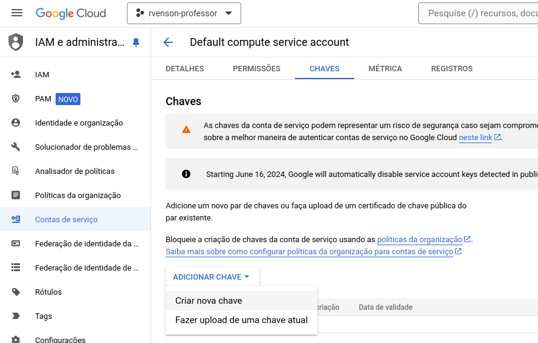

<!-- 
_class: lead
-->

# Aula 19 - Implantação e Containers

---

<!--
paginate: true
class: normal
-->

## Maven CLI

O comando `mvn` pode ser usado para rodar a ferramenta maven e interagir com o projeto. Um `wrapper` é geralmente disponibilizado na pasta de projetos criados pela IDE para que seja possível rodar um projeto sem o Maven instalado.

Esse comando permite rodar perfils de execução específicos, como `test` para rodar testes de aplicação e `compile` para compilação.

Plugins para o Maven como o do projeto `spring-boot` permitem a definição de perfis de execução alternativos, como o `mvn spring-boot:run` para rodar uma aplicação `spring-boot`.

---

### Lista de Comandos

|comando|descrição|
|-|-|
|`mvn install`|Instala dependências especificadas no arquivo `pom.xml`|
|`mvn test`|Roda todos os casos de teste declarados no projeto|
|`mvn compile`|Compila o código fonte do projeto|
|`mvn clean`|Remove todos os arquivos compilados (pasta `target`)|
|`mvn package`|Cria um pacote WAR ou JAR para distribuição|
|`mvn spring-boot:run`|Roda um projeto spring-boot|

---

## JAR

O comando `java -jar meuapp.jar` pode ser utilizado para rodar uma aplicação distribuível no formato `jar`.

O `jar` é um tipo de arquivo compactado executável usado para distribuição das classes java e outros recursos de um projeto. Esse tipo de pacote também pode ser "ofuscado" para que o conteúdo não seja (facilmente) identificável.

---

## Docker


O *Docker* é um padrão de encapsulamento de bibliotecas e ambientes em **containers padronizados**

Isso permite que ambientes de execução sejam compartilhados sem diferenças e com o mínimo de esforço.

---

## Componentes do Docker


O Docker pode ser dividido em diferentes componentes:

* Imagem
* Container
* Volume
* Rede

---

### Imagens

Uma imagem Docker define o ambiente e o conjunto de instruções que serão executadas em um **container**. 

Podemos consultar as imagens disponíveis localmente no Docker usando o comando:

````sh
docker image ls
````

Para instalar uma imagem vinda do repositório [hub.docker.com](https://hub.docker.com):

````sh
docker pull docker # imagem oficial do docker
````

---

### Containers

Containers são instâncias de ambientes e aplicações. **Containers não são máquinas virtuais**, visto que estas requerem um sistema operacional completo.

Diferentes containers podem rodar simultaneamente na mesma máquina hospedeira (*host*) de forma completamente isolada ou compartilhando recursos.

Podemos consultar os containers rodando localmente:

````sh
docker container ps
````

Para rodar um container a partir de uma imagem:

````sh
docker run docker:latest
````

---


---

### Volumes

Um container não possui persistência dos dados após o fim do seu ciclo de vida. O uso de volumes implementa um sistema de arquivos virtual para os containers armazenarem e compartilharem dados entre si e a máquina hospedeira.


### Redes

Outro recurso importante e poderoso do docker é a possibilidade de criar redes virtuais, que interagem com o hospedeiro e entre os containers. Isso permite que a comunicação de rede de diferentes containers seja encapsulada em uma estrutura mais segura.

---

### Dockerfile

O `Dockerfile` é um arquivo de texto usado para definir a criação de uma imagem. Ele permite partir de uma imagem previamente criada, determinando novas características e pacotes para a imagem resultante:

````yml
FROM debian:latest
RUN apt-get update && apt-get upgrade -y
RUN apt-get install nginx -y
CMD ["nginx", "-g", "daemon off;"]
````

---

### CI/CD

`Continuous Integration` (CI) funciona enviando pequenos pedaços de código para a base de código do seu aplicativo hospedada em um repositório Git e, a cada envio, execute um pipeline de scripts para criar, testar e validar as alterações de código antes de mesclá-las na ramificação principal.

`Continuous Delivery` (CD) consiste em um passo adicional da CI, implantando seu aplicativo na produção a cada push na ramificação padrão do repositório.

---


---

O CI/CD do GitLab é configurado por um arquivo chamado `.gitlab-ci.yml`, colocado na raiz do repositório. Os scripts definidos neste arquivo são executados pelo GitLab Runner.

Os Runners podem ser configurados em ambiente privado (mesmo que o repositório esteja hospedado no [GitLab](https://gitlab.com). O GitLab também disponibiliza *Shared Runners* que são compartilhados entre os projetos hospedados na plataforma.

---

### Exemplo de `.gitlab-ci.yml`

````yaml
image: node:8.10.0
cache:
  paths:
    - node_modules/
stages:
  - deploy_production
production:
  image: ruby:latest
  only:
    - master
  stage: deploy_production
  script:
    - apt-get update -qy
    - apt-get install -y ruby-dev
    - gem install dpl
    - dpl --provider=heroku --app=$HEROKU_APP_NAME --api-key=$HEROKU_API_KEY
````

---

### Configurando o `.gitlab-ci.yml`

O arquivo ``.gitlab-ci.yml`` deve ser adicionado na pasta raiz do projeto para que o Gitlab possa reconhecer as configurações e executar os *runners*.

É nesse arquivo que vamos especificar os **Stages**, as fases do CI que geralmente serão executadas depois de um commit no repositório.

Cada **Stage** possui diferentes **Jobs**, que definem uma tarefa rodada pelos *runners*.

[Sintaxe do .gitlab-ci.yml](https://docs.gitlab.com/ee/ci/yaml/)

---

#### Exemplo

A cada commit adicionado em nosso repositório, vamos garantir que o software continua passando em todos os testes e ainda é possível ser compilado. Dessa forma podemos definir inicialmente dois **Stages**: `test` e `build`

````yml
stages:
  - test
  - build
````

---

No mesmo arquivo vamos definir um job que fará parte do primeiro stage, e fará os testes unitários no nosso projeto:

````yml
testes-unitarios:
  stage: test
  image: maven:3.8.3-openjdk-17
  script:
    - mvn clean test
````

O parâmetro `image` define uma imagem docker que será utilizada para rodar o *job* que estamos chamando de `testes-unitarios`.

O parâmetro `script` define uma lista de comandos que serão executados pelo *runner*. Nesse caso, vamos limpar e testar o projeto.

---

Vamos adicionar também um *job* que fará a compilação da nossa aplicação:

````yml
pacote-jar:
  stage: build
  image: maven:3.8.3-openjdk-17
  script:
    - mvn clean package -DskipTests
  artifacts:
    paths:
      - ./target/*.jar
    when: always
    expire_in: 1 hrs
  only:
    - master
````

Aqui temos um novo parâmetro: o `artifacts` salva o arquivo `.jar` gerado para uso em outros *runners* e também pode ser acessado na página do projeto.

---

Os parâmetros `when` e `expire_in` definem que esse artefato será armazenado sempre, mesmo em caso de insucesso, por pelo menos uma hora.

Repare temos ainda um parâmetro chamado `only`, que serve para que este *job* seja executado apenas quando o *commit* for relacionado ao *branch* `master`

---

### Executando o CICD


Após criar o arquivo `.gitlab-ci.yml` na raiz do projeto, vamos commitar e enviar as alterações para a página do projeto no Gitlab. Dessa forma, a pipeline deve ser inicializada imediatamente (ou assim que os *runners* estiverem disponíveis).

---

## Containerizando uma Aplicação

Para criar um container que rode uma aplicação, primeiro iremos criar uma imagem docker para contê-la, incluindo todos os pacotes e dependências necessárias para o seu funcionamento. Para isso vamos criar um arquivo `Dockerfile` **na pasta raiz** da aplicação:

````yml
FROM openjdk:17-alpine # imagem base
COPY /target/*.jar app.jar # copia apenas o jar
EXPOSE 8080 # documenta o uso da porta 8080
ENTRYPOINT ["java","-jar","/app.jar"] # comando ao iniciar o container
````

---

### Criando uma imagem nova

Para criar uma imagem nova, na raiz da aplicação, onde está definido o `Dockerfile`, vamos rodar o seguinte comando:

````sh
docker build -t meuapp:latest .
````

Verifique se a imagem foi gerada corretamente:

````sh
docker image ls
````

E para rodar a imagem recém criada, use:

````sh
docker run meuapp:latest
````

---

## Gitlab Registry

O Gitlab Registry é uma funcionalidade do Gitlab que permite atribuir imagens à um projeto. Desde que essa funcionalidade esteja habilitada no projeto, podemos realizar usar o terminal para realizar o login nesse repositório.

O login pode ser realizado com usuário e senha:

````
docker login -u meu_usuario_gitlab -p minha_senha registry.gitlab.com
````


No entanto, é interessante criar um Token de acesso para realizar essa operação.

---

### Criando um Token

Para criar um **Token de Autenticação**, vá até as configurações do seu projeto e acesse a opção `Tokens de Acesso` > `Adicionar novo token`. Não esqueça de marcar os escopos relacionados ao envio e leitura de registros: `read_registry` e `write_registry`.

Com o token em mãos, utilize ele ao invés da sua senha:

````
docker login -u meu_usuario_gitlab -p meu_token registry.gitlab.com
````

---

### CICD e Registry

É possível configurar um **Job** para registrar imagens automaticamente no Registry do seu projeto, para isso, adicione a seguinte tarefa no seu `.gitlab-ci.yml`.

Utilizando *Runners* é possível utilizar variáveis de ambiente padronizadas do Gitlab para autenticar e acessar a URL do Registry do seu projeto automaticamente.

---

Segue o exemplo:

````yml
deploy-gitlab:
  image: docker
  stage: deploy
  services:
    - docker:dind
  before_script:
    - docker login -u $CI_REGISTRY_USER -p $CI_JOB_TOKEN $CI_REGISTRY
  script:
    - docker build -t $CI_REGISTRY_IMAGE .
    - docker push $CI_REGISTRY_IMAGE
  dependencies:
    - build
  only:
    - master
````

---

## Ambiente de Produção

Existem diversas maneiras diferentes de tornar uma aplicação disponível na internet a partir da pasta do projeto, do projeto empacotado (jar ou war) ou do container docker.

Quando uma aplicação encontra-se em ambiente operacional, onde pode ser utilizado para executar suas tarefas pretendidas em ambiente final, chamamos isso de **Ambiente de Produção**.

---

Existem diversas maneiras de realizar a implantação de um software a partir do seu código fonte, projeto compactado (`jar` ou `war`) ou seu container docker.

Uma estrutura de nuvem (*cloud*) pode ser utilizada como implantação definitiva para um software, contendo todas as ferramentas necessárias para escalonar, controlar e monitorar o funcionamento da aplicação.

No entanto, dezenas de configurações incluem também o uso de servidores locais, com servidores dedicados e/ou virtualizados, além de nuvens privadas em configuracões chamadas de ***On-Premise***.

---

### Implantação na Nuvem

Serviços populares em nuvem oferecem diferentes configurações para implantação de aplicações dependendo das necessidades de uso e escalonamento. Em algumas das nuvens populares podem ser utilizados:

* **Amazon Web Services**: Beanstalk (EB), Kubernetes (EKS), Container (ECS), Lambda
* **Azure**: App Service, Kubernetes (AKS), Spring Apps, Functions
* **Google Cloud**: App Engine, Kubernetes (GKE), Cloud Run, Cloud Functions
* **Digital Ocean**: App Plataform, Kubernets, Droplets
* **Oracle**: Cloud Infrastructure (OCI), Kubernets (OKE), Functions
* **IBM**: Cloud Foundry, Kubernets, Functions

---

## Google Cloud Run

Implantar um novo serviço usando o Cloud Run da Google exige que a aplicação esteja no formato de um container docker, mas permite liberdade para definir os serviços e a configuração de plataforma que será utilizada. 


---

`NOTA IMPORTANTE`: A maioria dos serviços em nuvem é pago por uso e exige uso de cartão de crédito. Não instancie novos serviços sem ter ideia dos custos gerados na sua conta.

Alguns serviços contam com um ***Free Tier***, que estabelece cotas de uso que não são tarifados pelas plataformas.

---

Outra vantagem do Cloud Run é o escalonamento automático, que inicia novas instâncias do container em função da quantidade do uso atual da aplicação.

Para configurações com maior complexidade e controle, como redes específicas e padrões de escalonamento mais rígidos, pode-se migrar do Cloud Run para o **Google Kubernets Engine** (GKE)

---

## Configurando Google Cloud

Vamos seguir os seguintes passos para configurar nossa conta no Google Cloud:

* Criar/Acessar uma conta Google e acessar o site: [console.google.com](https://console.google.com);
* Criar um novo projeto;
* Ativar o `Cloud Run Admin API`, `Service Usage API ` `Cloud Build API`;
* Criar uma nova conta de serviço (opcional);
* Criar uma nova chave para a conta de serviço e salvar;
* Fazer a compilação do jar;
* Adicionar o Dockerfile;
* Usar o Cloud CLI e fazer o upload da aplicação;

---


### Tela inicial do Google Cloud

Para criar um novo projeto, acesse o menu superior e clique no botão `New Project`

---


### Crie um novo projeto


Nessa tela apenas especifique o nome do projeto. De preferência à nomes únicos.

---


### Adicione novas APIs

Procure pelo menu `API e Serviços` e em `APIs e serviços ativados` selecione o botão `Ativar APIS e Serviços`

---


### Adicione as APIs necessárias

Para essa implantação, vamos precisar de três APIs: `Cloud Run Admin`, `Service Usage API ` `Cloud Build API`. Ative as três nessa sequência.

---


### Adicione as APIs necessárias

Procure pelo menu `IAM e administração` e em `Contas de serviço` clique na conta de serviço `Default Compute service account` (ou crime uma nova)

---



### Gere uma Chave

Faça a geração de uma nova chave aba `Chaves` da conta de serviço, botão `Adicionar chave` e opção `Criar nova chave`. Crie a chave no formato `json` e faça o download.

---

### Compile sua aplicação

Agora vá até a pasta do seu projeto e realize a compilação do pacote `jar` executando o comando na raiz da aplicação:

````cmd
mvn package
````

ou

````cmd
./mvnw package
````

Certifique-se de que o `.jar` foi gerado corretamente na pasta `target`.

---

### Criando o Dockerfile

Crie um novo arquivo na raiz do projeto chamado `Dockerfile` com o conteúdo:

````dockerfile
FROM openjdk:17-alpine
COPY /target/*.jar app.jar
EXPOSE 8080
ENTRYPOINT ["java","-jar","/app.jar"]
````

Esse arquivo será usado pelo docker para construir uma imagem que executa a sua aplicação.

> Você pode substituir o openjdk:17-alpine por openjdk:22-alpine caso use uma versão mais nova da JDK na sua aplicação.

---

### Google Cloud CLI

Primeiro vamos usar o Google Cloud para realizar a *build* da nossa aplicação e armazená-la no **Container Registry**. Isso permite que aplicações possam ser executadas rapidamente com a imagem nos servidores da Google.

Antes de tudo, vamos precisar de uma ferramenta chamada `gcloud`, que pode ser instalada a partir do site Google Cloud. Também podemos usar uma imagem docker que já possui essa ferramenta instalada.

---

#### Iniciando um container docker com `gcloud`

Para iniciar um novo container docker, vamos primeiro organizar nosso projeto em uma pasta, junto com a chave `json` que baixamos da conta de serviço:

````
- meu_aplicativo
  - src <-- pasta raiz do seu projeto
  - chave.json <-- chave da conta de serviço
````

De preferência pra hierarquia acima para os próximos passos para não se perder. Abra o terminal na pasta `meu_aplicativo`.

---

Para rodar um container docker com o gcloud instalado, rode o seguinte comando no terminal enquanto estiver na pasta `meu_aplicativo` (que contém a pasta do projeto + chave):

````cmd
docker run -it --mount src=.,target=/app,type=bind google/cloud-sdk:alpine bash
````

A imagem do gcloud será baixada na primeira vez e um novo container será iniciado. Se tudo correr bem, você estará dentro do container assim que o processo for finalizado.

Verifique que o seu projeto e a chave são acessíveis de dentro do contaienr usando os comandos `cd /app` e `ls -lA`.

---

#### Autenticando no gcloud

Vamos autenticar no gcloud usando o comando:

````sh
gcloud auth activate-service-account --key-file nome-do-arquivo-da-chave.json
````

Se tudo correr bem, configure o caminho do seu projeto usando o comando:

````sh
gcloud config set project id-do-projeto
````

Verifique o ID do projeto na página do Google Cloud. Por fim, configure o docker:

````sh
gcloud auth configure-docker
````

---

#### Realizando a Build

Para realizar a build do projeto e a criação da imagem que será armazenada da nuvem da Google, use o comando:

````sh
gcloud builds submit --tag gcr.io/id-do-projeto/nome-do-servico
````

Não esqueça de substituir o id do seu projeto e o nome do servico, que representa um nome da imagem que será armazenada. Você pode utilizar o mesmo nome da sua aplicação (ex.: `meu-app`)

---

#### Rodando Cloud Run

Por fim, com a imagem armazenada na nuvem, utilize o mesmo nome de serviço e execute o comando a seguir para criar o *runner* para a sua aplicação no Google Cloud Run.

````sh
gcloud run deploy nome-do-servico --image gcr.io/id-do-projeto/nome-do-servico --region=us-central1 --platform managed --allow-unauthenticated
````

E pronto! Sua aplicação deve estar disponível na web =)

> Caso a aplicação não seja acessível (FORBIDDEN), altere a configuração no Google Run para permitir o acesso não autenticado.

---

## Gitlab CI/CD e Google Run

Para automatizar o deploy usando as pipelines de CI/CD do Gitlab, podemos adicionar (ou criar caso não exista) ao arquivo `gitlab-ci.yml` o seguinte modelo de *job*:

````yml
deploy-gcloud:
  image: google/cloud-sdk:alpine
  stage: deploy
  script:
    - echo $SERVICE_ACCOUNT_KEY > service-account-key.json
    - gcloud auth activate-service-account --key-file service-account-key.json
    - gcloud config set project $PROJECT_ID 
    - gcloud auth configure-docker
    - gcloud builds submit --tag gcr.io/$PROJECT_ID/$SERVICE_ID
    - gcloud run deploy $SERVICE_ID --image gcr.io/$PROJECT_ID/$SERVICE_ID --region=us-central1 --platform managed --allow-unauthenticated
  dependencies:
    - build
  when: manual
  only:
    - master
````

---

Repare o uso de algumas variáveis no script. Dessa forma vamos precisar inicializar essas variáveis diretamente na configuração do projeto no Gitlab, em `Configurações` > `CICD` > `Variáveis`.

Insira cada uma das três variáveis:

* Chave `SERVICE_ID`: valor `nome_da_aplicacao` (escolha um nome)
* Chave `PROJECT_ID`: valor `slug-projeto` (nome encontrado na página inicial do projeto no Google Cloud, chamada `ID do projeto`);
* Chave `SERVICE_ACCOUNT_KEY`: copie o conteúdo da chave `.json` gerada anteriormente.

---

## Docker Compose

O Docker Compose é uma ferramenta do Docker (antigamente plugin) que permite definir e rodar múltiplos containers, facilitando a execução de ambientes complexos e permitindo uma criação mais fácil de redes e volumes.

Para usar o Docker Compose, podemos definir na raiz do projeto um arquivo de texto chamado `docker-compose.yml` (esse não é mais um padrão).

---

<dual>

````yml
services:

  postgres:
    image: postgres
    ports:
      - "5432:5432"
    networks:
      - app-network

  meu-app:
    image: meu-app:latest
    container_name: meu-app
    volume: ./data:meu-app
    networks:
      - app-network
    build:
      dockerfile: ./Dockerfile
    ports:
      - "3001:3001"
    depends_on:
      - postgres
      
````
````yml
networks: 
  app-network:
    driver: nat

volumes:
  meu-app:
````
Essa configuração (exemplo) permite abrir dois containers, um para o banco de dados e outro para a aplicação, conectando-os em uma rede virtual. Para iniciar a configuração, use:

````sh
docker compose up -D
````

</dual>

---

## O que aprendemos hoje

* Executar comandos básicos do maven;
* O que é o Docker Engine e como criar imagens e containers;
* Como automatizar pipelines usando o CICD do Gitlab;
* Como criar containers usando o CICD;
* Como fazer deploy de um container no Google Cloud;
