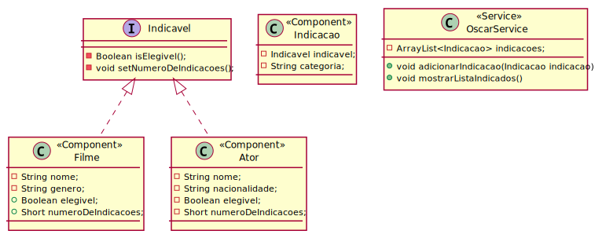
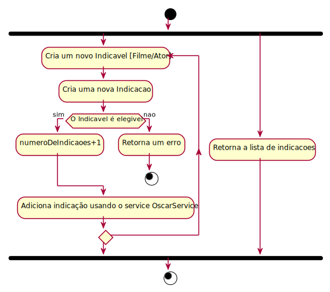

<!-- 
_class: lead
-->

# Avaliação 01 - Lista de Exercícios

---

<!--
paginate: true
-->

## Calendário

| nº | Turma 01 | Turma 02 |
|--|--|--|
|01|11 de Março|13 de Março|
|02|18 de Março|20 de Março|
|03|25 de Março|27 de Março|
|04|01 de Abril|03 de Abril|
|05|06 de Maio|08 de Maio|
|06|06 de Maio|08 de Maio|

---

## Entrega

Cada um dos exercícios deverá ser postado pelo estudante em um repositório pessoal em um serviço de hospedagem de repositórios git (Gitlab, Github...).

O repositório será compartilhado com o professor e deve estar em **modo público** (ou com permissões de acesso ao professor).

A raiz deve conter um arquivo README.md, assim como a separação de **uma pasta para cada um dos exercícios** abaixo.

Exercícios em grupo **devem ser postados individualmente** por cada participante da equipe.

---

## Exercício 01

Implemente um programa em java que seja capaz de gerar aleatoriamente e retornar no console o seguinte modelo de mensagem:

````
Cássio Ramos é um futebolista brasileiro de 32 anos que atua como goleiro. Atualmente defende o Corinthians.
````

A mensagem de texto deverá conter os seguintes atributos aleatórios:
* [Nome](https://venson.net.br/resources/data/nomes.txt) e [sobrenome](https://venson.net.br/resources/data/sobrenomes.txt) aleatórios
* Idade (entre 17 e 40 anos)
* [Posição](https://venson.net.br/resources/data/posicoes.txt) (aleatória)
* [Clube](https://venson.net.br/resources/data/clubes.txt) (aleatório)

---

## Exercício 02

Utilizando como base o exercício anterior, crie uma classe chamada `JogadorGerador` contendo um método capaz de realizar as requisições HTTP apenas uma vez e construir múltiplos objetos do tipo `Jogador`.

Crie também uma classe chamada `Jogador` contendo métodos que permitam que cada dado do jogador seja acessado individualmente através de métodos (`getNome`, `getSobrenome`, `getPosicao`, `getIdade`, `getClube`) e um método que gere a mensagem do exercício anterior (`getDescricao`).

---

## Exercício 3

Crie um novo projeto usando o Spring Framework que implemente um **service** chamado `OscarService` que seja responsável por adicionar filmes e atores à uma lista de indicados (array do tipo `Indicacao`). O service também deverá retornar a lista com todos os indicados e suas categorias;

Um ator ou filme não poderá ser indicado um atributo `elegivel` for falso. Para cada nova indicação, um atributo `numeroDeIndicacoes` deve ser incrementado. Ambos os atributos devem ser manipulado por meio de uma interface chamada `Indicavel`.

---



---



---

Todos os atributos devem ter sua visibilidade `private`. Crie getters e setters para os atributos que necessitem de acesso/modificação.

O projeto deverá seguir a estrutura dos diagramas UML, porém alterações que incluam funcionalidades ou alterem o nome das classes são permitidas desde que mantenham o formato da implementação.

O projeto deverá conter pelo menos:

* 1x Service
* 1x Interface
* 3x Components

> BONUS: Implemente também a persistência da lista de indicados em um arquivo de texto;

---

## Exercício 04

Crie um web service capaz de prover através de requisição GET uma mensagem como a do exercício 01 / exercício 02. Novas mensagens/jogadores devem ser geradas à cada requisição. O web service deverá carregar uma lista de [nomes](https://venson.net.br/resources/data/nomes.txt), [sobrenomes](https://venson.net.br/resources/data/sobrenomes.txt), [posições](https://venson.net.br/resources/data/posicoes.txt) e [clubes](https://venson.net.br/resources/data/clubes.txt) apenas durante sua inicialização.

> Bônus: Implemente uma rota extra para gerar e apresentar jogadores diretamente no formato JSON.

---

## Exercício 05

Crie um documento (formatos ODX, DOC, DOCX ou MD) contendo a modelagem proposta pela Fase 2 da [Atividade da Aula 13](../aulas/aula13/aula13-atividade01.pdf). Esse documento deverá conter uma descrição da modelagem realizada, bem como todas as rotas/endpoints definidos pelo grupo.Para cada um dos recursos, deve ser especificado um conjunto de métodos necessários para realizar **operações CRUD**. Cada método deverá incluir: **URI**, **Método HTTP**, **Requisição esperada**, **Erros esperados** e **Status Codes**.

**ATENÇÃO!** A postagem desse documento deverá ser feita no repositório de TODOS os membros do grupo.

---

## Exercício 06

Utilizando os modelos do exercício anterior e da Fase 3 da [Atividade da Aula 13](../aulas/aula13/aula13-atividade01.pdf). Implemente um controlador de uma aplicação Spring que faça o mapeamento dos recursos desenvolvidos.

* O desenvolvimento deverá ser feito utilizando Spring Boot.
* Apenas um controller é necessário
* Não é necessário implementar services ou modelos. Cada rota pode retornar null ou um dado mockup (de exemplo e estático).

**ATENÇÃO!** A postagem desse documento deverá ser feita no repositório de TODOS os membros do grupo.